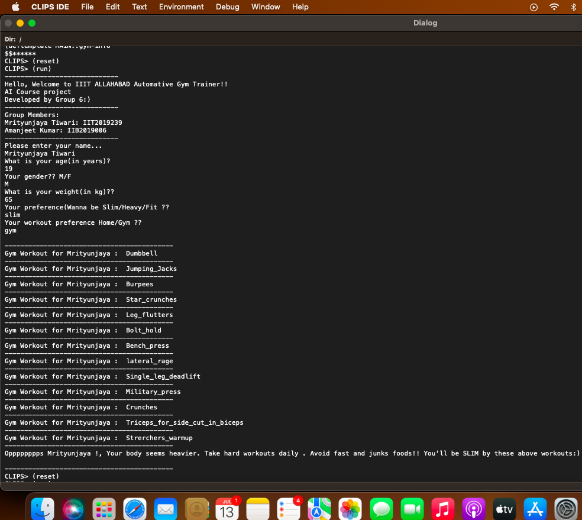
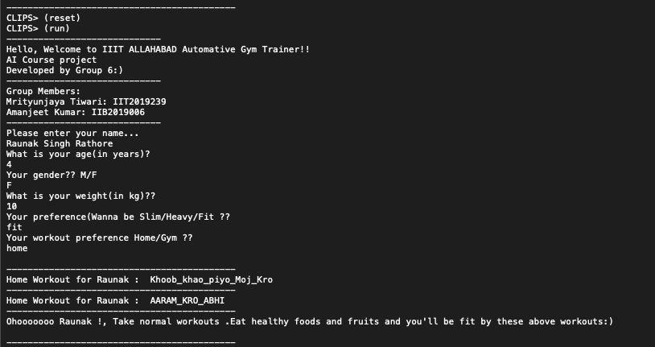
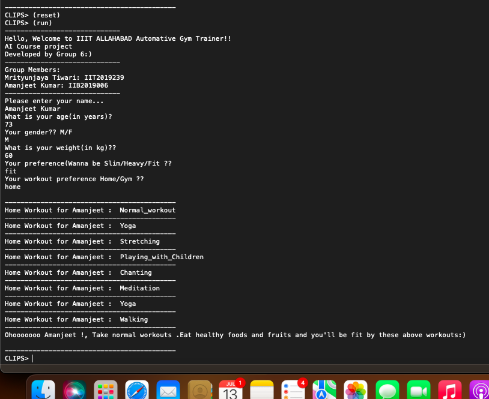

# Automative Gym Recommendation System for IIIT Allahabad
Aartificial Intelligence Course Project
#### Uder supervision of Prof. Anupam Agarwaal
<hr>

<!-- TABLE OF CONTENTS -->
<details open="open">
  <summary>Table of Contents</summary>
  <ol>
    <li>
      <a href="#about-the-project">About The Project</a>
    </li>
    <li><a href="#built-with">Built With</a></li>
    <li>
      <a href="#getting-started">Getting Started</a>
      <ul>
        <li><a href="#prerequisites">Prerequisites</a></li>
        <li><a href="#installation">Installation</a></li>
      </ul>
    </li>
    <li><a href="#how-to-use">How to use</a></li>
    <ul>
        <li><a href="#iiit-allahabad-virtual-museum-outside-look">Museum outer look</a></li>
        <li><a href="#interactions-of-artifacts-with-avtar">Interfaction with artifacts by Virtual Avtar</a></li>
      </ul>
     <li><a href="#demo-video">Demo Video</a></li>
     <li><a href="#team-members">Team Members</a></li>
     <li><a href="#important-project-links">Important Project Links</a></li>
    <li><a href="#acknowledgements">Acknowledgements</a></li>
  </ol>
</details>
<hr>

## About The Project
Automotive Gym Recemendor system is an AI expert system which will get personalised trainings by taking few personal infos, like<br>
--What is your name<br>
--What is your gender<br>
-- What is your age<br>
-- What is your weight<br>
-- What do you wanna be(slim/fat/heavy)<br>
-- mode(home/Gym) etc....

<hr>

## Built With
<ul>
   <li>Clips</li>
   <li>Philips</li>
</ul>

<hr>

<!-- GETTING STARTED -->
## Getting Started

This is an example of how you may give instructions on setting up your project locally.
To get a local copy up and running follow these simple example steps.

### Prerequisites 

This is an example of how to list things you need to use the software and how to install them.
  * Software: Clips
  * Text editor (VS code, notepad etc....)

 ### Installation

1. Clone the repo
   ```sh
   git clone https://github.com/Error404m/gym_iiita
   ```
2. Change directory to main file
   ```sh
   cd codes
   ```
3. Install Clips
   ```sh
   Link: https://www.clipsrules.net/
   ```
4. Setup the clips software and open.
5. Go to File
6. Open Project
7. Then, browse to where that project is located
8. Select that project. Then, open it.

<hr>

<!-- Usage -->
### How to use

1. Step 1 
   ```sh
   Open Clips IDE.
   ```
2. Step 2
   ```sh
    Go to file -> Open -> Select code.clips file. New editor will be poped out.
   ```
   
3. Step 3
   ```sh
   Select all Ctr+A , then click over load selection . In this way, code will be loaded in IDE.
   ```
   
4. Step 4 | Run command
   ```sh
   (reset)
   ```
   
5. Step 5 | Run command
   ```sh
   (run)
   ```
6. Step 6 | Run command
   ```sh
   Enter the name.
   ```
       
7. Step 7
   ```sh
   Enter the age.
   ```
   
8. Step 8
   ```sh
   Enter the gender(M/F).
   ```
   
9. Step 9
   ```sh
   Enter the wight.
   ```
   
10. Step 10
   ```sh
   Your preference(Wanna be Slim/Heavy/Fit 
   ```
   
11.  Step 11
   ```sh
  Your workout preference Home/Gym 
   ```
   
12. This way you can get your personalised gym traning recomendation .
   
### Demo Screenshot 1
Entered details for young user seeking for slimming out his body from Gym trainings .
<br><br> 

### Demo Screenshot 2
Entered details for small boy seeking for fit body from home trainings .
<br><br> 

### Demo Screenshot 3
Entered details for senior citizen user seeking for fit body from home trainings .
<br><br> 

<!-- Usage -->
<hr>

## Demo Video
[](https://www.youtube.com/watch?v=2biJNqQ9WkU)

<hr>
<iframe width="560" height="315" src="https://www.youtube.com/embed/2biJNqQ9WkU" title="YouTube video player" frameborder="0" allow="accelerometer; autoplay; clipboard-write; encrypted-media; gyroscope; picture-in-picture" allowfullscreen></iframe>
<!-- Acknowledgements -->
## Team Members  
   
| Profile | Name | Enrollment Number | 
| :-------------: | :-------------: | ------------- |
|  | Mrityunjaya Tiwari| IIT2019239 
| | AMANJEET KUMAR| IIB2019006  

<hr>

<!-- Important Project Links -->
## Important Project Links
* [Website Frontend (only for demo) ](https://error404m.github.io/gym_iiita/)
* [Report Docs](https://error404m.github.io/gym_iiita/)
* [PPT Presentation](https://error404m.github.io/gym_iiita/)
